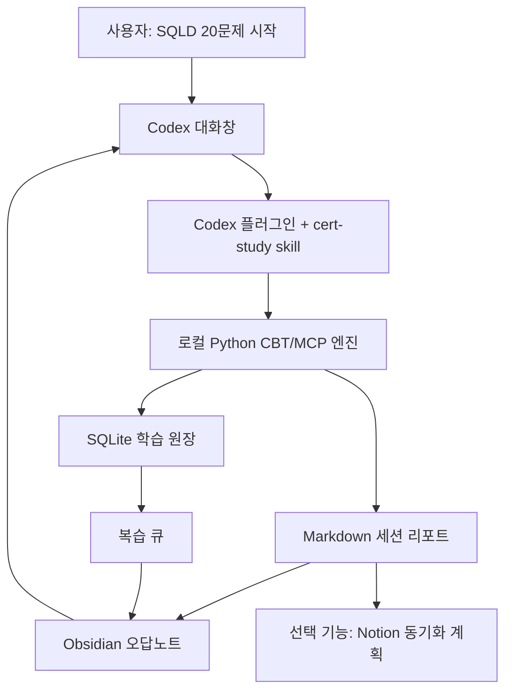
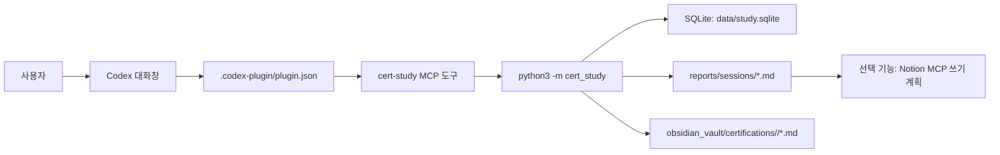

# 코덱스 학습 시스템

Codex를 CBT 시험장, 학습 코치, 오답노트 작성자로 쓰기 위한 로컬 학습 플러그인입니다.

제가 이 프로젝트에서 잡은 핵심은 “LLM이 문제를 내준다”가 아닙니다. 자격증 공부에서 실제로 막히는 지점은 문제를 한 번 푸는 게 아니라, 내가 어떤 개념을 반복해서 틀리는지 남기고, 틀린 이유를 해설과 함께 복구하고, 며칠 뒤 다시 꺼내보는 루프를 유지하는 것입니다.

그래서 굳이 웹앱까지 만들지 않았습니다. Codex 대화창을 시험 인터페이스로 쓰고, 로컬 Python 엔진이 세션, 채점, 오답, 복습 큐를 SQLite에 기록합니다. 세션이 끝나면 Markdown 리포트와 Obsidian에서 바로 볼 수 있는 오답노트가 생성됩니다.

이 레포는 공개 포트폴리오용 코드베이스입니다. 개인 학습 DB, 실제 풀이 기록, Obsidian 산출물은 git에 올리지 않도록 제외했습니다. 포함된 세 과목 문항도 상업 문제집이나 실제 시험 덤프가 아니라, 시스템 동작을 보여주기 위한 합성 훈련 문항입니다.

## 1. 왜 만들었나

자격증 공부를 AI로 도와준다고 하면 보통 “문제 만들어줘”, “요약해줘”에서 끝나기 쉽습니다. 그런데 실제 학습 루프에서는 아래 문제가 더 큽니다.

| 구분 | 실제 문제 | 왜 중요한가 |
| --- | --- | --- |
| 세션 관리 | 오늘 몇 문제를 풀었고 어디까지 답했는지 흐려짐 | 채팅만으로 공부하면 상태가 사라짐 |
| 채점 근거 | 점수는 나오지만 합격선과 영역별 결과가 분리되지 않음 | 실제 시험 대비 판단이 약해짐 |
| 오답 기록 | 틀린 개념 이름만 남고, 내 답/정답/해설이 빠짐 | 다시 봐도 왜 틀렸는지 복구가 안 됨 |
| 반복 오답 | 같은 개념을 여러 번 틀려도 누적 추적이 안 됨 | 약점 기반 재출제가 어려움 |
| 노트 정리 | 사람이 읽는 오답노트와 기계가 계산하는 원장이 섞임 | 보기 좋은 노트와 채점 원장을 분리해야 함 |
| 저작권 | 문제집/기출을 그대로 쌓고 싶어짐 | 공개 포트폴리오와 개인 학습 모두 리스크가 생김 |

정리하면 이 구조입니다.

> Codex 플러그인은 CBT 인터페이스와 MCP 도구를 제공한다. 학습 상태와 채점은 로컬 엔진이 결정론적으로 관리한다. 오답노트는 Obsidian/Markdown을 기본값으로 두고, Notion은 사용자가 원할 때만 켜는 선택 동기화 대상으로 둔다.



## 2. 만든 것

`codex-learning-system`이라는 Codex 기반 학습 플러그인을 만들었습니다.

첫 구현 대상은 SQLD였고, 지금은 ADsP와 정보처리기사까지 공개 합성 문제은행을 추가했습니다. 세션을 시작하면 시스템이 문제를 하나씩 내고, 사용자의 답을 기록하고, 마지막에 점수와 합격선, 영역별 결과, 틀린 문제, 내 답, 정답, 해설, 오답 이유, 반복 오답, 다음 복습일을 정리합니다.

현재 공개 repo에 포함된 기본 CBT 과목은 `SQLD`, `ADSP`, `KR_INFO_PROCESSING_ENGINEER`입니다. 이 문제들은 최근 공식 출제범위에 맞춘 합성 훈련 문항입니다. 공개 seed는 포트폴리오 데모용 1회분 수준이라, 실전 학습은 개인 로컬 `private_banks/`로 문제은행을 키우는 전제를 둡니다. 실제 기출, 족보, 유료 문제집 원문은 공개 repo에 넣지 않습니다. AWS, GCP처럼 별도 자료를 확보한 과목은 로컬에서 import했을 때만 `available`로 뜨고 CBT 세션을 시작할 수 있습니다.

| 구성 | 위치 | 역할 |
| --- | --- | --- |
| 플러그인 매니페스트 | `.codex-plugin/plugin.json` | Codex가 설치 가능한 플러그인으로 인식하는 메타데이터 |
| MCP 설정 | `.mcp.json` | `cert-study` stdio MCP 서버 연결 |
| MCP 서버 | `cert_study/mcp_server.py` | `list_exams`, `start_session`, `submit_answer`, `finish_session`, 선택적 `prepare_notion_sync` 도구 제공 |
| CLI 진입점 | `cert_study/cli.py` | `init`, `session start`, `answer`, `finish`, `report`, 선택적 `notion plan` 명령 제공 |
| SQLite 스키마 | `cert_study/db.py` | 시험, 도메인, 개념, 문제, 세션, 풀이, 복습 큐 저장 |
| CBT 엔진 | `cert_study/engine.py` | 미노출 우선 문제 선택, 약점/복습 세트, 답변 기록, 채점, 합격권 판정, 복습 큐 갱신 |
| 리포트 렌더러 | `cert_study/reporting.py` | 세션 결과와 오답노트를 Markdown으로 생성 |
| Obsidian 내보내기 | `cert_study/obsidian.py` | 세션 노트, 개념 노트, 복습 큐 생성 |
| Notion 동기화 하네스 | `cert_study/notion_sync.py` | 선택 기능. 기본값은 실제 쓰기 없이 계획만 생성 |
| 공개 문제 seed | `cert_study/seed_sqld.py`, `cert_study/seed_adsp.py`, `cert_study/seed_info_processing.py` | SQLD 50개, ADsP 50개, 정보처리기사 100개 합성 훈련 문항 |
| 개인 문제 importer | `cert_study/importer.py` | `private_banks/`의 JSON/YAML 문제은행을 로컬 DB에만 가져오는 도구 |
| 자료 변환기 | `cert_study/importers/` | 로컬에 둔 허용 라이선스 자료를 import-ready JSON으로 바꾸는 도구 |
| Codex skill | `skills/cert-study/SKILL.md` | Codex가 CBT 감독관처럼 행동하도록 하는 운영 규칙 |
| Obsidian 문서 | `docs/obsidian-vault.md` | Markdown vault 구조와 개인 기록 경계 설명 |
| 과목 확장 계획 | `docs/exam-expansion-plan.md` | 2~3개 이상 과목 확장 시 JSON/YAML importer로 전환하는 권장 설계 |
| Notion 스키마 | `docs/notion-schema.md` | 선택 동기화용 DB 설계 |
| 테스트 하네스 | `tests/test_study_system.py` | 문제 수, 세션 진행, 채점, Obsidian 내보내기, 플러그인 형태, Notion 기본 비활성 검증 |

## 3. AI가 하는 일과 하지 않는 일

AI는 학습 인터페이스와 튜터 역할을 맡습니다. 예를 들어 사용자가 “SQLD 20문제 시작해줘”라고 하면 Codex는 플러그인의 MCP 도구를 호출하고, 문제를 하나씩 보여주고, 세션이 끝나면 리포트를 읽기 쉽게 요약합니다. 오답 리포트를 보고 “오늘 복습할 개념”도 설명할 수 있습니다.

반대로 채점과 세션 상태는 LLM에게 맡기지 않았습니다. 정답 여부, 점수, 합격선 판정, 오답 누적, 다음 복습일은 SQLite와 Python 코드가 처리합니다. 같은 입력이면 같은 결과가 나와야 하기 때문입니다.


## 4. 구조

이 프로젝트는 웹 서비스가 아닙니다. 프론트엔드는 Codex 대화창이고, 백엔드는 로컬 Python CLI/MCP 서버입니다.



| 레이어 | 역할 |
| --- | --- |
| Codex 대화창 | CBT 인터페이스, 사용자의 답변 입력, 리포트 요약 |
| 플러그인 매니페스트 | Codex 설치/로드 메타데이터 |
| Codex skill | 언제 어떤 도구를 실행할지 정하는 운영 규칙 |
| MCP 도구 | Codex가 직접 호출하는 `start_session`, `submit_answer`, `finish_session` 인터페이스 |
| Python CLI | 사람이 직접 실행할 수 있는 동일 엔진의 CLI 표면 |
| SQLite | 학습 원장, 오답 누적, 복습 큐 |
| Markdown 내보내기 | 사람이 읽는 세션 결과 |
| Obsidian vault | 사람이 읽고 탐색하는 기본 오답노트 |
| Notion MCP | 선택 동기화 대상. 원장이 아니라 보조 DB 뷰 |

개인 학습 기록은 `.gitignore`로 제외했습니다.

```text
data/study.sqlite
reports/sessions/*.md
obsidian_vault/**/*.md
```

## 5. 안전 경계

이 프로젝트의 안전 경계는 두 가지입니다. 학습 결과를 과장하지 않는 것. 공개 레포에 올리면 안 되는 자료를 넣지 않는 것.

| 리스크 | 대응 |
| --- | --- |
| 실제 기출/족보 복제 | 포함된 문제은행은 합성 훈련 문항으로 제한 |
| 상업 문제집 저작권 | 문제집 원문 저장 대신 개념 태그, 오답 이유, 자작 유사문항 중심으로 설계 |
| 개인 학습 기록 노출 | SQLite DB와 세션 리포트는 git ignore 처리 |
| LLM 채점 오류 | 채점/점수/복습 큐는 결정론적 Python 코드에서 처리 |
| 외부 노트 도구 과의존 | 기본 오답노트는 로컬 Markdown/Obsidian으로 생성 |
| 공개 repo에서 자동 외부 쓰기 | Notion 동기화 하네스는 기본 비활성. `CERT_STUDY_ENABLE_NOTION_SYNC=1` 전에는 쓰기 계획만 생성 |
| 합격 보장 과장 | 이 레포는 학습 시스템 구현 사례이며 시험 합격을 보장하지 않음 |

Obsidian 연동도 같은 원칙을 따릅니다. `sessions`, `concepts`, `review-queue.md`로 사람이 읽는 오답노트를 만들되, 채점과 복습 스케줄의 원장은 SQLite에 둡니다.

Notion은 선택 기능입니다. `Study Sessions`, `Wrong Questions`, `Concept Reviews` DB로 정리할 수 있지만, 공개 기본값에서는 실제 Notion 쓰기를 하지 않습니다. 어떤 페이지와 row를 만들지 사용자가 검토할 수 있는 계획만 생성합니다.

## 6. 검증

현재 공개 코드베이스 기준으로 검증한 것은 아래입니다.

```bash
python3 -m unittest discover -s tests
```

| 검증 항목 | 내용 |
| --- | --- |
| 공개 seed bank | SQLD 50개, ADsP 50개, 정보처리기사 100개 로드 |
| 도메인 배분 | 20문제 세션에서 데이터 모델링 4문제, SQL 기본 및 활용 16문제 배분 |
| 답변 진행 | 답변을 기록하면 다음 미응답 문제가 반환됨 |
| 채점 | 정답 수와 환산 점수, 합격권 판정 계산 |
| 오답 리포트 | 내 답, 정답, 해설, 오답 이유, 복습 개념 포함 |
| Obsidian 내보내기 | 세션 노트, 개념별 오답 노트, 복습 큐가 `obsidian_vault/`에 생성됨 |
| 플러그인 매니페스트 | `.codex-plugin/plugin.json`이 skill과 MCP 서버를 선언 |
| MCP 도구 | `list_exams`, `start_session`, `submit_answer`, `finish_session`, `prepare_notion_sync` 도구 노출 |
| 순차 출제 | SQLD, ADsP, 정보처리기사 세션이 정답표 없이 첫 문제만 반환 |
| 개인 importer | `--private` 없이는 개인 소유 문제은행 import를 거부 |
| Notion 기본값 | 환경변수 없이는 `disabled_public_default` 상태로 계획만 생성 |

CLI 스모크 테스트:

```bash
python3 -m cert_study init --reset
python3 -m cert_study stats
python3 -m cert_study session start --exam SQLD --count 5 --seed 1
```

출제 반복 방지 기준:

| 모드 | 기준 |
| --- | --- |
| `custom-cbt` | 아직 노출되지 않은 문제를 먼저 출제하고, 최근에 본 문제는 뒤로 보냄 |
| `review-cbt` | 복습 예정일이 지난 오답 문제와 오답 이력이 있는 문제를 먼저 출제 |
| `weak-cbt` | 자주 틀린 개념의 다른 문항을 먼저 출제 |

문제은행 규모 기준:

| 과목 | 공개 데모 seed | 개인 실전 최소 | 권장 |
| --- | ---: | ---: | ---: |
| SQLD | 50 | 250~300 | 500+ |
| ADsP | 50 | 250~300 | 500+ |
| 정보처리기사 | 100 | 500~600 | 1000+ |

공개 seed는 이 시스템이 작동한다는 증거입니다. 같은 문제를 외우지 않으려면 개인 문제은행을 `private_banks/`로 확장하고, 엔진의 미노출/약점/복습 우선 출제를 활용하는 방향이 맞습니다.

정확히 말하면, 이 프로젝트가 증명한 것은 “SQLD를 합격시켜준다”가 아닙니다. 증명한 것은 “Codex 플러그인을 개인 CBT 학습 루프의 인터페이스로 쓰고, 학습 상태와 오답 기록은 재현 가능한 로컬 하네스로 관리할 수 있다”입니다.

## 7. 포트폴리오에서 보여주는 것

이 프로젝트는 AI 서비스 개발자, LLM 프로덕트 엔지니어, AI 워크플로우 빌더 포트폴리오로 쓰기 좋게 설계했습니다.

| 역할 요구 | 이 프로젝트에서 보여준 부분 |
| --- | --- |
| AI 워크플로우 설계 | Codex 플러그인/채팅을 CBT 인터페이스로 쓰는 학습 루프 설계 |
| 로컬 우선 도구화 | Python CLI와 SQLite로 개인 학습 원장 구현 |
| 평가/하네스 사고 | 채점, 세션 진행, 리포트 생성, Obsidian 내보내기, Notion 동기화 계획 테스트 |
| 구조화 데이터 | 시험, 영역, 개념, 문제, 풀이, 복습 큐 스키마 |
| 사람 참여형 루프 | 사용자는 채팅으로 답하고, 시스템은 기록/분석을 보조 |
| 신뢰 경계 | LLM은 설명과 인터페이스, 결정론적 코드는 채점과 상태 관리 |
| 지식 워크플로우 | Obsidian Markdown을 기본 오답노트로 두고 Notion MCP는 선택 기능으로 격리 |

포트폴리오 포인트는 “AI로 공부한다”가 아닙니다.

> Codex를 실제 개인 업무 흐름에 붙여서, 문제풀이/오답/복습/Obsidian 정리까지 이어지는 재현 가능한 학습 하네스를 만들었다.

## 플러그인 구조

이 레포는 Codex 플러그인 형태입니다.

```text
.codex-plugin/plugin.json
.mcp.json
skills/cert-study/SKILL.md
cert_study/mcp_server.py
```

MCP 서버가 제공하는 도구는 아래와 같습니다.

| 도구 | 역할 |
| --- | --- |
| `init_study_db` | 로컬 SQLite 초기화와 공개 합성 문제은행 seed |
| `list_exams` | 현재 실제 출제 가능한 과목과 계획 단계 과목 확인 |
| `start_session` | CBT 세션 시작과 첫 문제 반환 |
| `submit_answer` | 1~4번 답변 기록과 다음 문제 반환 |
| `finish_session` | 세션 채점과 리포트 생성 |
| `prepare_notion_sync` | 선택 기능. 기본 비활성 Notion 쓰기 계획 생성 |

Obsidian Markdown이 기본 오답노트입니다. 기존 Obsidian vault에 바로 쓰고 싶다면 아래처럼 설정하면 됩니다.

```bash
export CERT_STUDY_OBSIDIAN_VAULT="/absolute/path/to/Obsidian Vault"
```

Notion 쓰기는 공개 기본값에서 자동으로 실행되지 않습니다. 개인 환경에서 Notion을 쓰려면 먼저 대상 DB를 고른 뒤 아래 환경변수를 켜야 합니다.

```bash
export CERT_STUDY_ENABLE_NOTION_SYNC=1
```

그래도 플러그인은 계획만 준비합니다. 실제 Notion MCP 쓰기는 사용자가 대상 DB를 고른 뒤 Codex가 수행하는 구조입니다.

## 로컬에서 실행하기

```bash
git clone https://github.com/Merchantlee99/26_codex_learningsystem.git
cd 26_codex_learningsystem
python3 -m cert_study init
python3 -m cert_study stats
python3 -m cert_study session start --exam SQLD --count 20
python3 -m cert_study session start --exam ADSP --count 20
python3 -m cert_study session start --exam KR_INFO_PROCESSING_ENGINEER --count 20
python3 -m cert_study session start --exam SQLD --count 10 --mode weak-cbt
python3 -m cert_study session start --exam SQLD --count 10 --mode review-cbt
python3 -m cert_study coverage --exam AWS_CLOUD_PRACTITIONER
python3 -m cert_study session start --exam AWS_CLOUD_PRACTITIONER --regular --mode exam-ready
```

답변을 기록하려면:

```bash
python3 -m cert_study session answer <session_id> 3
```

모든 문제를 푼 뒤 결과를 생성하려면:

```bash
python3 -m cert_study session finish <session_id>
```

선택 기능인 Notion 동기화 계획은 이렇게 확인합니다.

```bash
python3 -m cert_study notion plan <session_id>
```

개인 로컬 문제은행을 가져오려면 `examples/private_bank.example.json` 형식을 참고해서 `private_banks/` 아래에 둡니다. 이 폴더는 git에 올라가지 않습니다.

```bash
mkdir -p private_banks
python3 -m cert_study bank import private_banks/my-bank.json --private
```

허용 라이선스가 명확한 로컬 원천 자료는 변환기를 거쳐 import-ready JSON으로 바꿀 수 있습니다. 예를 들어 `gail-exam-preparation`의 `exam-data.ts`를 직접 확보해 둔 경우:

```bash
python3 -m cert_study bank convert-gcp-gail \
  private_banks/raw_sources/gcp/gail_exam_preparation/lib/exam-data.ts \
  private_banks/import_ready/gcp/gcp_generative_ai_leader_gail_exam_preparation.json

python3 -m cert_study bank import \
  private_banks/import_ready/gcp/gcp_generative_ai_leader_gail_exam_preparation.json

python3 -m cert_study bank promote-gcp-gail --checked-at 2026-07-03
```

새 importer 형식은 기존 `answer: 1`도 계속 받지만, 가능하면 아래 메타데이터를 같이 둡니다.

```json
{
  "question_type": "single_choice",
  "answer_json": { "choices": [2] },
  "source_type": "public_license",
  "source_license": "MIT",
  "source_tier": "open_license",
  "storage_policy": "raw_allowed",
  "validity_status": "needs_official_check",
  "quality_status": "needs_review",
  "scope_version": "2026",
  "official_checked_at": "",
  "quality_notes": "공식 가이드 대조 전",
  "provenance": {
    "repository": "https://github.com/example/study-source",
    "path": "lib/exam-data.ts",
    "official_doc": "https://cloud.google.com/..."
  }
}
```

`exam-ready` 모드는 내부 CBT 방식 그대로 동작하지만, 아래 조건을 만족하는 문항만 출제합니다.

- `quality_status = active`
- `source_tier = official_sample | open_license | user_owned | licensed_private`
- `question_type = single_choice`

즉, 합성 seed나 공식 검수 전 문항은 실전 모드에서 자동 제외됩니다. 부족한 과목은 먼저 `coverage`로 어느 영역이 비어 있는지 확인한 뒤 `private_banks/` 문제은행을 보강합니다.

정보처리기사처럼 ZIP/PDF 자료가 있는 과목은 먼저 private archive를 점검합니다. 이 명령은 PDF 후보만 세고, 원문 문제를 공개 repo나 DB로 복사하지 않습니다.

```bash
python3 -m pip install -e ".[pdf]"
python3 -m cert_study bank inspect-info-processing private_banks/raw_sources/info_processing/sinagong
```

## 과목 추가

이 공개 레포는 `SQLD`, `ADSP`, `KR_INFO_PROCESSING_ENGINEER`를 공개 합성 문제은행으로 둡니다.

공개 데모용 합성 과목 하나를 더 추가하는 정도라면 지금 seed 패턴을 복사하면 됩니다.

```text
cert_study/seed_sqld.py
cert_study/seed_adsp.py
cert_study/seed_info_processing.py
```

실제 과목이 2~3개 이상이 되면 Python seed 파일을 계속 늘리기보다 JSON/YAML 문제은행 가져오기 도구로 바꾸는 게 맞습니다. 이 레포는 importer를 포함합니다. 개인 학습 목표 목록은 아래처럼 잡았습니다.

```text
SQLD
ADSP
KR_INFO_PROCESSING_ENGINEER
AWS_AI_PRACTITIONER
AWS_CLOUD_PRACTITIONER
AWS_SOLUTIONS_ARCHITECT_ASSOCIATE
GCP_GENERATIVE_AI_LEADER
```

권장 가져오기 도구 설계, 검증 규칙, 공개/비공개 데이터 경계는 [docs/exam-expansion-plan.md](docs/exam-expansion-plan.md)에 정리했습니다.

## 레포 구조

```text
.codex-plugin/
  plugin.json
.mcp.json
cert_study/
  cli.py
  db.py
  engine.py
  importer.py
  importers/
    gcp_gail.py
  quality.py
  mcp_server.py
  notion_sync.py
  obsidian.py
  paths.py
  reporting.py
  seed_adsp.py
  seed_info_processing.py
  seed_public.py
  seed_sqld.py
config/
  notion_sync.example.json
docs/
  architecture.md
  exam-expansion-plan.md
  obsidian-vault.md
  notion-schema.md
obsidian_vault/
  .gitkeep
examples/
  private_bank.example.json
skills/
  cert-study/SKILL.md
scripts/
  sync_notion.py
tests/
  test_study_system.py
README.md
AGENTS.md
```

## 현재 범위

구현된 것:

- Codex 플러그인 매니페스트
- CBT 세션용 stdio MCP 도구
- 지원 과목 확인용 `list_exams` 도구
- SQLD 합성 문제은행 50문항
- ADsP 합성 문제은행 50문항
- 정보처리기사 합성 문제은행 100문항
- 개인 JSON/YAML 문제은행 importer
- 문제 출처/라이선스/보관정책/유효성 상태 메타데이터
- 문제 품질 상태와 source tier 기반 `exam-ready` 출제 모드
- 공식 도메인 비중 대비 문제은행 커버리지 리포트
- GCP Generative AI Leader 로컬 자료 변환기
- GCP Generative AI Leader 공식 문서 URL 기반 exam-ready 승격 명령
- 정보처리기사 private ZIP/PDF 후보 inspector
- 미노출 우선, 복습 예정, 취약 개념 기반 출제 우선순위
- CBT 세션 시작/답변/현재 문제/종료 명령
- SQLite 학습 원장
- 점수와 합격선 리포트
- 오답 리포트
- 복습 큐
- Obsidian용 Markdown 내보내기
- 기본 비활성 Notion 동기화 계획 하네스
- Codex skill 지침
- 단위 테스트 하네스

아직 구현하지 않은 것:

- 사용자 DB 선택 없는 직접 Notion MCP 쓰기 자동화
- AWS / GCP 원천 문제의 공개 repo 포함
- 다중 선택형 문항 채점
- 고급 spaced repetition 알고리즘
- 웹/모바일 UI
