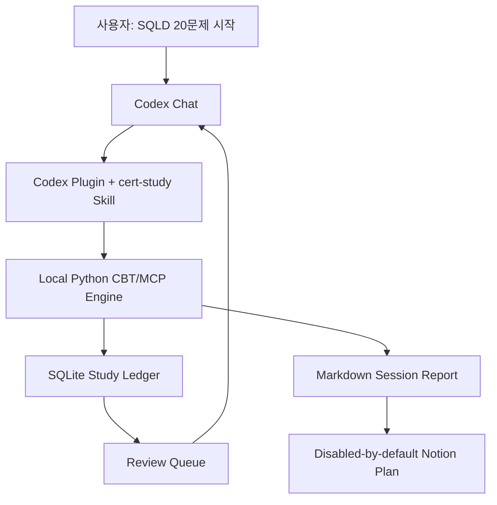
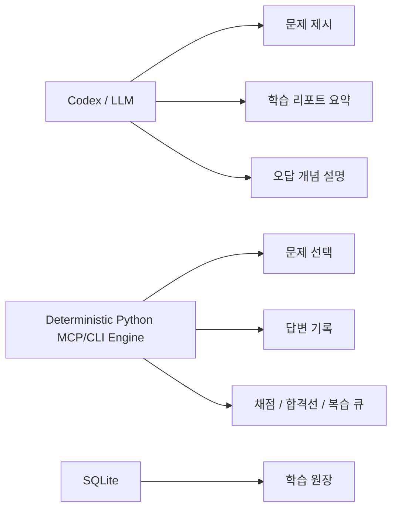
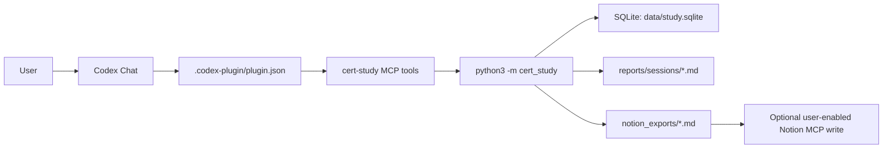

# Codex Learning System

Codex를 CBT 시험장, 학습 코치, 오답노트 작성자처럼 쓰기 위한 로컬 학습 플러그인입니다.

제가 이 프로젝트에서 본 핵심은 단순히 “LLM이 문제를 내준다”가 아니었습니다. 자격증 공부에서 실제로 어려운 지점은 문제를 한 번 푸는 것이 아니라, 내가 어떤 개념을 반복해서 틀리는지 기록하고, 틀린 이유를 해설과 함께 남기고, 다음 복습 시점에 다시 꺼내는 루프를 유지하는 것입니다.

그래서 이 프로젝트는 웹앱을 만들지 않고, Codex 대화창을 시험 인터페이스로 쓰는 방식으로 만들었습니다. 사용자는 채팅에서 답하고, 로컬 Python 엔진은 세션, 채점, 오답, 복습 큐를 SQLite에 기록합니다. 세션이 끝나면 사람이 읽을 수 있는 Markdown 리포트와 Notion에 옮기기 쉬운 오답노트 계획이 생성됩니다.

이 레포는 공개 포트폴리오용 코드베이스이면서 설치 가능한 Codex plugin 형태를 갖습니다. 개인 학습 DB, 실제 풀이 기록, Notion export 결과물은 git에 올리지 않도록 제외했습니다. 포함된 SQLD 문항은 상업 문제집이나 실제 시험 덤프가 아니라, 시스템 동작을 검증하기 위한 synthetic 훈련 문항입니다.

## 1. Problem

자격증 공부를 AI로 도와준다고 하면 보통 “문제를 만들어줘”, “요약해줘”에서 끝나기 쉽습니다. 하지만 실제 학습 루프에서는 아래 문제가 더 중요합니다.

| 구분 | 실제 문제 | 왜 중요한가 |
| --- | --- | --- |
| 세션 관리 | 오늘 몇 문제를 풀었고 어디까지 답했는지 흐려짐 | 채팅만으로 공부하면 상태가 사라짐 |
| 채점 근거 | 점수는 나오지만 합격선과 영역별 결과가 분리되지 않음 | 실제 시험 대비 판단이 약해짐 |
| 오답 기록 | 틀린 개념 이름만 남고, 내 답/정답/해설이 빠짐 | 다시 봐도 왜 틀렸는지 복구가 안 됨 |
| 반복 오답 | 같은 개념을 여러 번 틀려도 누적 추적이 안 됨 | 약점 기반 재출제가 어려움 |
| 노션 정리 | 사람이 읽는 오답노트와 기계가 계산하는 원장이 섞임 | 보기 좋지만 자동 분석은 약해짐 |
| 저작권 | 문제집/기출을 그대로 쌓고 싶어짐 | 공개 포트폴리오와 개인 학습 모두 리스크가 생김 |

그래서 문제를 이렇게 좁혔습니다.

> Codex plugin이 CBT 인터페이스와 MCP 도구를 제공하되, 학습 상태와 채점은 로컬 엔진이 deterministic하게 관리하고, Notion은 사용자가 선택해 켤 수 있는 오답노트 projection으로만 사용한다.



## 2. What I Built

제가 만든 것은 `codex-learning-system`이라는 Codex-native 학습 플러그인입니다.

첫 구현 대상은 SQLD입니다. SQLD 세션을 시작하면 시스템이 문제를 하나씩 내고, 사용자의 답을 기록하고, 마지막에 점수와 합격선, 영역별 결과, 틀린 문제, 내 답, 정답, 해설, 오답 이유, 반복 오답, 다음 복습일을 정리합니다.

| 구성 | 위치 | 역할 |
| --- | --- | --- |
| Plugin manifest | `.codex-plugin/plugin.json` | Codex가 설치 가능한 plugin으로 인식하는 메타데이터 |
| MCP config | `.mcp.json` | `cert-study` stdio MCP server 연결 |
| MCP server | `cert_study/mcp_server.py` | `start_session`, `submit_answer`, `finish_session`, `prepare_notion_sync` 도구 제공 |
| CLI entrypoint | `cert_study/cli.py` | `init`, `session start`, `answer`, `finish`, `report`, `notion plan` 명령 제공 |
| SQLite schema | `cert_study/db.py` | 시험, 도메인, 개념, 문제, 세션, 풀이, 복습 큐 저장 |
| CBT engine | `cert_study/engine.py` | 문제 선택, 답변 기록, 채점, 합격권 판정, 복습 큐 갱신 |
| Report renderer | `cert_study/reporting.py` | 세션 결과와 오답노트를 Markdown으로 생성 |
| Notion sync harness | `cert_study/notion_sync.py` | 기본 비활성 상태에서 Notion write plan만 생성 |
| SQLD seed bank | `cert_study/seed_sqld.py` | synthetic SQLD 훈련 문항 50개 |
| Codex skill | `skills/cert-study/SKILL.md` | Codex가 CBT 감독관처럼 행동하도록 하는 운영 규칙 |
| Notion schema | `docs/notion-schema.md` | `Study Sessions`, `Wrong Questions`, `Concept Reviews` DB 설계 |
| Harness tests | `tests/test_study_system.py` | 문제 수, 세션 진행, 채점, plugin shape, Notion disabled default 검증 |

## 3. AI Role

AI를 쓴 위치와 쓰지 않은 위치를 분리했습니다.

Codex와 LLM은 학습 인터페이스와 튜터 역할을 맡습니다. 예를 들어 사용자가 “SQLD 20문제 시작해줘”라고 하면 Codex는 플러그인의 MCP 도구를 호출하고, 문제를 하나씩 보여주고, 세션이 끝나면 리포트를 읽기 쉽게 요약합니다. 또한 오답 리포트를 바탕으로 “오늘 복습할 개념”을 설명할 수 있습니다.

반대로 채점과 세션 상태는 LLM에게 맡기지 않았습니다. 정답 여부, 점수, 합격선 판정, 오답 누적, 다음 복습일은 SQLite와 Python 코드가 처리합니다. 같은 입력이면 같은 결과가 나와야 하기 때문입니다.



## 4. Architecture

이 프로젝트는 웹 서비스가 아닙니다. 프론트엔드는 Codex 대화창이고, 백엔드는 로컬 Python CLI/MCP server입니다.



| 레이어 | 역할 |
| --- | --- |
| Codex Chat | CBT 인터페이스, 사용자의 답변 입력, 리포트 요약 |
| Plugin manifest | Codex 설치/로드 메타데이터 |
| Codex Skill | 언제 어떤 도구를 실행할지 정하는 운영 규칙 |
| MCP tools | Codex가 직접 호출하는 `start_session`, `submit_answer`, `finish_session` 인터페이스 |
| Python CLI | 사람이 직접 실행할 수 있는 동일 엔진의 CLI 표면 |
| SQLite | 학습 원장, 오답 누적, 복습 큐 |
| Markdown Export | 사람이 읽는 세션 결과 |
| Notion MCP | 선택적 동기화 대상. 원장이 아니라 오답노트 projection |

개인 학습 기록은 `.gitignore`로 제외했습니다.

```text
data/study.sqlite
reports/sessions/*.md
notion_exports/*.md
```

## 5. Trust & Safety

이 프로젝트의 안전 경계는 두 가지입니다. 첫째, 학습 결과를 과장하지 않는 것. 둘째, 공개 레포에 올리면 안 되는 자료를 넣지 않는 것입니다.

| 리스크 | 대응 |
| --- | --- |
| 실제 기출/족보 복제 | included question bank는 synthetic 훈련 문항으로 제한 |
| 상업 문제집 저작권 | 문제집 원문 저장 대신 개념 태그, 오답 이유, 자작 유사문항 중심으로 설계 |
| 개인 학습 기록 노출 | SQLite DB와 세션 리포트는 git ignore 처리 |
| LLM 채점 오류 | 채점/점수/복습 큐는 deterministic Python 코드에서 처리 |
| Notion 과의존 | Notion은 읽기 좋은 오답노트 projection으로만 사용 |
| 공개 repo에서 자동 외부 쓰기 | Notion sync harness는 기본 비활성. `CERT_STUDY_ENABLE_NOTION_SYNC=1` 전에는 write plan만 생성 |
| 합격 보장 과장 | 이 레포는 학습 시스템 구현 사례이며 시험 합격을 보장하지 않음 |

Notion 연동도 같은 원칙을 따릅니다. `Study Sessions`, `Wrong Questions`, `Concept Reviews` DB로 정리하되, Notion이 원장이 되지 않도록 했습니다. 공개 기본값에서는 실제 Notion 쓰기를 하지 않고, 어떤 페이지와 row를 만들지 사용자가 검토할 수 있는 plan만 생성합니다.

## 6. Evidence

현재 공개 코드베이스 기준으로 검증한 것은 세 가지입니다.

```bash
python3 -m unittest discover -s tests
```

| 검증 항목 | 내용 |
| --- | --- |
| SQLD seed bank | synthetic SQLD 문항 50개 로드 |
| domain allocation | 20문제 세션에서 데이터 모델링 4문제, SQL 기본 및 활용 16문제 배분 |
| answer progression | 답변을 기록하면 다음 미응답 문제가 반환됨 |
| scoring | 정답 수와 환산 점수, 합격권 판정 계산 |
| wrong-note report | 내 답, 정답, 해설, 오답 이유, 복습 개념 포함 |
| Notion export | 세션 리포트가 `notion_exports/`에도 생성됨 |
| Plugin manifest | `.codex-plugin/plugin.json`이 skill과 MCP server를 선언 |
| MCP tools | `start_session`, `submit_answer`, `finish_session`, `prepare_notion_sync` 도구 노출 |
| Notion sync default | 환경변수 없이는 `disabled_public_default` 상태로 plan만 생성 |

CLI smoke test:

```bash
python3 -m cert_study init --reset
python3 -m cert_study stats
python3 -m cert_study session start --exam SQLD --count 5 --seed 1
```

정확히 말하면, 이 프로젝트가 증명한 것은 “SQLD를 합격시켜준다”가 아닙니다. 증명한 것은 “Codex plugin을 개인 CBT 학습 루프의 인터페이스로 쓰고, 학습 상태와 오답 기록은 재현 가능한 로컬 하네스로 관리할 수 있다”입니다.

## 7. Role Fit

이 프로젝트는 AI Service Developer, LLM Product Engineer, AI Workflow Builder 포트폴리오로 쓰기 좋게 설계했습니다.

| 역할 요구 | 이 프로젝트에서 보여준 부분 |
| --- | --- |
| AI workflow design | Codex plugin/chat을 CBT 인터페이스로 쓰는 학습 루프 설계 |
| Local-first tooling | Python CLI와 SQLite로 개인 학습 원장 구현 |
| Eval / harness thinking | 채점, 세션 진행, 리포트 생성, Notion sync plan 테스트 |
| Structured data | exam, domain, concept, question, attempt, review queue schema |
| Human-in-the-loop | 사용자는 채팅으로 답하고, 시스템은 기록/분석을 보조 |
| Trust boundary | LLM은 설명과 인터페이스, deterministic code는 채점과 상태 관리 |
| Knowledge workflow | Notion MCP를 읽기 좋은 오답노트 projection으로 설계하되 기본 비활성 처리 |

포트폴리오 포인트는 “AI로 공부한다”가 아닙니다.

> Codex를 실제 개인 업무 흐름에 붙여서, 문제풀이/오답/복습/노션 정리까지 이어지는 재현 가능한 학습 하네스를 만들었다.

## Plugin Shape

This repository is structured as a Codex plugin:

```text
.codex-plugin/plugin.json
.mcp.json
skills/cert-study/SKILL.md
cert_study/mcp_server.py
```

The MCP server exposes these tools:

| Tool | Purpose |
| --- | --- |
| `init_study_db` | Initialize local SQLite and seed SQLD training data |
| `start_session` | Start a CBT session and return the first question |
| `submit_answer` | Record a 1-4 answer and return the next question |
| `finish_session` | Score the session and generate reports |
| `prepare_notion_sync` | Generate a disabled-by-default Notion write plan |

Notion writes are intentionally not automatic in the public default. To use Notion in a private setup, the user should choose the target Notion databases first, then enable:

```bash
export CERT_STUDY_ENABLE_NOTION_SYNC=1
```

The plugin still prepares the plan; Codex should perform actual Notion MCP writes only after the user selects/approves the target databases.

## Run Locally

```bash
git clone https://github.com/Merchantlee99/26_codex_learningsystem.git
cd 26_codex_learningsystem
python3 -m cert_study init
python3 -m cert_study stats
python3 -m cert_study session start --exam SQLD --count 20
```

답변을 기록하려면:

```bash
python3 -m cert_study session answer <session_id> 3
```

모든 문제를 푼 뒤 결과를 생성하려면:

```bash
python3 -m cert_study session finish <session_id>
```

Notion sync plan:

```bash
python3 -m cert_study notion plan <session_id>
```

## Repository Structure

```text
.codex-plugin/
  plugin.json
.mcp.json
cert_study/
  cli.py
  db.py
  engine.py
  mcp_server.py
  notion_sync.py
  paths.py
  reporting.py
  seed_sqld.py
config/
  notion_sync.example.json
docs/
  architecture.md
  notion-cert-gallery.md
  notion-schema.md
skills/
  cert-study/SKILL.md
scripts/
  sync_notion.py
tests/
  test_study_system.py
README.md
AGENTS.md
```

## Current Scope

Implemented:

- Codex plugin manifest
- stdio MCP tools for CBT sessions
- certification thumbnail assets for Notion gallery cards
- SQLD synthetic question bank
- CBT session start/answer/current/finish commands
- SQLite learning ledger
- score and pass-line report
- wrong-question report
- review queue
- Notion-ready Markdown export
- disabled-by-default Notion sync plan harness
- Codex skill instructions
- unit harness

Not implemented yet:

- direct Notion MCP write automation without user-selected DB targets
- ADsP / 정보처리기사 / AWS / GCP question banks
- spaced repetition algorithm beyond simple next-review scheduling
- web or mobile UI
