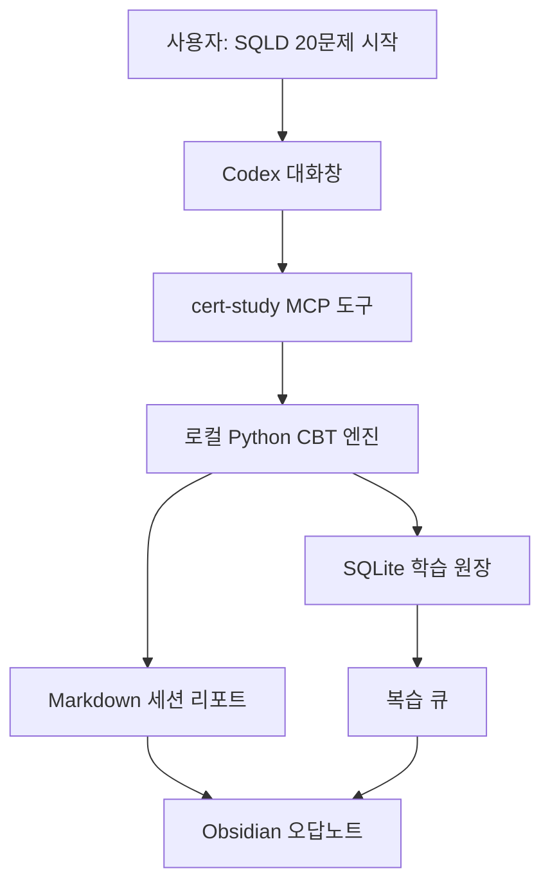

# 코덱스 학습 시스템

Codex 대화창을 SQLD CBT 시험장처럼 쓰기 위한 로컬 학습 플러그인입니다.

핵심은 “LLM이 문제를 만들어준다”가 아닙니다. 문제 출제, 답변 기록, 채점, 오답 리포트, 복습 큐를 로컬 Python 엔진과 SQLite가 관리하고, Codex는 사용자가 대화창에서 자연스럽게 시험을 풀 수 있게 연결합니다.

이 레포는 공개 포트폴리오용 코드베이스입니다. 실제 개인 문제은행, 풀이 기록, Obsidian 산출물, Notion 대상 DB 정보는 공개 repo에 넣지 않습니다. 공개 기본값은 SQLD 데모 문항만 둡니다.

## 왜 만들었나

자격증 공부를 AI로 도와준다고 하면 보통 “요약해줘”, “문제 내줘”에서 끝나기 쉽습니다. 그런데 실제 학습에서 더 중요한 것은 아래 루프입니다.

| 문제 | 이 프로젝트의 대응 |
| --- | --- |
| 채팅만 쓰면 풀이 상태가 사라짐 | 세션, 답변, 채점을 SQLite에 기록 |
| 정답만 보면 왜 틀렸는지 복구가 안 됨 | 내 답, 정답, 해설, 오답 이유를 리포트에 남김 |
| 같은 개념을 반복해서 틀려도 추적이 약함 | 반복 오답 개념과 복습 큐를 별도로 관리 |
| 노트 정리가 별도 일이 됨 | Obsidian에서 읽을 수 있는 Markdown 오답노트 생성 |
| 공개 repo에 문제 원문을 쌓기 쉬움 | 공개 seed는 SQLD 합성 데모 문항으로 제한 |



## 만든 것

| 구성 | 위치 | 역할 |
| --- | --- | --- |
| 플러그인 매니페스트 | `.codex-plugin/plugin.json` | Codex가 설치 가능한 플러그인으로 인식하는 메타데이터 |
| MCP 설정 | `.mcp.json` | `cert-study` stdio MCP 서버 연결 |
| MCP 서버 | `cert_study/mcp_server.py` | `list_exams`, `start_session`, `submit_answer`, `finish_session`, `prepare_notion_sync` 도구 제공 |
| CLI | `cert_study/cli.py` | 같은 엔진을 터미널에서 실행하는 표면 |
| SQLite 스키마 | `cert_study/db.py` | 시험, 영역, 개념, 문제, 세션, 풀이, 복습 큐 저장 |
| CBT 엔진 | `cert_study/engine.py` | 미노출 우선 출제, 답변 기록, 채점, 복습 큐 갱신 |
| 리포트 | `cert_study/reporting.py` | 점수, 합격선, 오답, 복습 개념을 Markdown으로 생성 |
| Obsidian 내보내기 | `cert_study/obsidian.py` | 세션 노트, 개념 노트, 복습 큐 생성 |
| Notion 하네스 | `cert_study/notion_sync.py` | 기본 비활성. 실제 쓰기 전 계획만 생성 |
| 공개 seed | `cert_study/seed_sqld.py` | SQLD 합성 데모 문항 50개 |
| import 구조 | `cert_study/importer.py`, `cert_study/importers/` | 로컬 문제은행을 DB로 가져오는 확장 표면 |
| Codex skill | `skills/cert-study/SKILL.md` | 한 문제씩 출제하고 정답표를 미리 공개하지 않도록 하는 운영 규칙 |
| 테스트 | `tests/test_study_system.py` | 세션, 채점, 오답노트, 플러그인 형태 검증 |

## AI가 하는 일과 하지 않는 일

Codex는 인터페이스와 학습 코치 역할을 맡습니다. 사용자가 “SQLD 20문제 시작”이라고 말하면 MCP 도구를 호출하고, 문제를 하나씩 보여주고, 마지막에 결과를 요약합니다.

채점과 상태 관리는 LLM에게 맡기지 않습니다. 정답 여부, 점수, 합격선, 반복 오답, 다음 복습일은 Python 코드와 SQLite가 처리합니다. 같은 입력이면 같은 결과가 나와야 하기 때문입니다.

## 실행

```bash
git clone https://github.com/Merchantlee99/26_codex_learningsystem.git
cd 26_codex_learningsystem
python3 -m cert_study init
python3 -m cert_study stats
python3 -m cert_study session start --exam SQLD --count 20
```

답변:

```bash
python3 -m cert_study session answer <session_id> 3
```

종료와 리포트 생성:

```bash
python3 -m cert_study session finish <session_id>
```

약점/복습 세트:

```bash
python3 -m cert_study session start --exam SQLD --count 10 --mode weak-cbt
python3 -m cert_study session start --exam SQLD --count 10 --mode review-cbt
```

## Codex에서 쓰는 흐름

```text
SQLD 20문제 시작해줘
```

그러면 시스템은 첫 문제만 보여줍니다. 사용자가 답을 입력하면 다음 문제로 넘어갑니다. 세션 종료 전에는 정답표나 해설을 먼저 공개하지 않습니다.

최종 리포트에는 아래가 들어갑니다.

- 점수와 합격선
- 합격권 판정
- 영역별 결과
- 틀린 문제
- 내가 고른 답
- 정답
- 해설
- 추정 오답 이유
- 반복 오답 개념
- 오늘 복습할 개념
- 다음 복습일

## 공개 repo 경계

이 repo는 문제 저장소가 아닙니다.

| 들어가는 것 | 들어가지 않는 것 |
| --- | --- |
| SQLD 합성 데모 문항 | 실제 기출 원문 |
| CBT 엔진과 MCP 도구 | 유료 문제집 내용 |
| SQLite/Obsidian/Notion 하네스 코드 | 개인 풀이 기록 |
| 테스트 코드 | 개인 Notion DB ID |
| 로컬 import 구조 | 로컬 private 문제은행 |

추가 문제은행은 로컬에서만 import합니다. `private_banks/`, `data/study.sqlite`, `reports/`, `obsidian_vault/`는 공개 repo에 올리지 않습니다.

## 문항 수를 늘리는 방식

공개 seed 50문항은 시스템 동작을 보여주는 데모입니다. 실제 학습용으로 문항 수를 늘릴 때는 공개 repo에 문제를 쌓지 않고, 로컬 JSON/YAML 문제은행을 import합니다.

```bash
python3 -m cert_study bank import private_banks/my-sqld-bank.json --private
python3 -m cert_study session start --exam SQLD --count 20 --mode source-backed
```

문항 수가 늘어나면 엔진은 미노출 문제를 먼저 내고, 최근에 본 문제는 뒤로 밀며, 복습/약점 모드에서는 오답 이력이 있는 개념을 우선합니다.

## 검증

```bash
python3 -m pytest -q
```

검증 범위:

- SQLD 공개 seed 50문항 로드
- 한 번에 한 문제만 출제
- 세션 답변 기록
- 정답 수와 점수 계산
- 합격선 표시
- 오답 리포트 생성
- Obsidian Markdown 내보내기
- Notion 동기화 기본 비활성
- 공개 repo에 개인 문제은행 없이도 플러그인 구조가 동작함

## 포트폴리오 포인트

이 프로젝트가 보여주는 것은 “AI가 문제를 만들어줬다”가 아닙니다.

> Codex를 개인 학습 워크플로우의 인터페이스로 붙이고, 채점과 상태 관리는 재현 가능한 로컬 하네스로 분리했다.

즉, LLM은 사용자 경험과 설명을 맡고, 신뢰가 필요한 채점/기록/복습 로직은 코드가 맡는 구조입니다.
